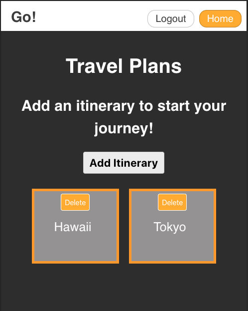
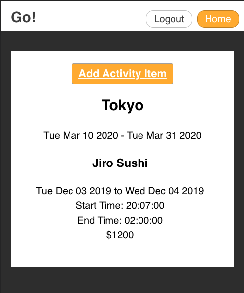

# Go!

Live App: https://go-app.now.sh/

## Summary
Go is an itinerary application that allows the requires an account to use. After logging in the user can create an itinerary with a start an end date. In that itinerary a user can create activity items. Activity items are travel plans for the users vacation. 

## Tech Stack 
React JS, HTML & CSS 

## Screenshots

### Landing: 

### Home/Itineraries List:

### Itinerary Activity-Items List:

